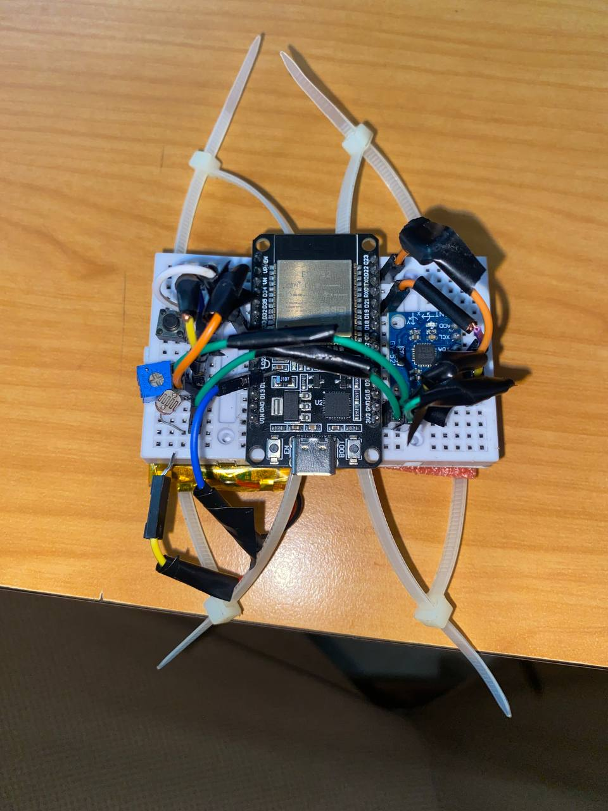
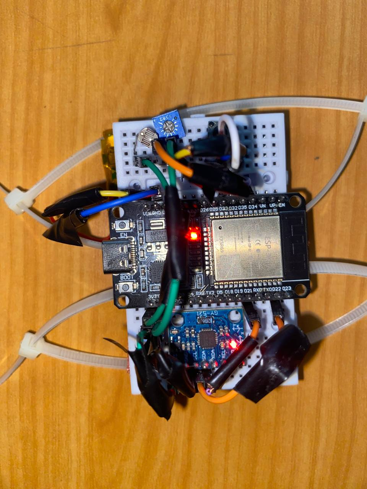
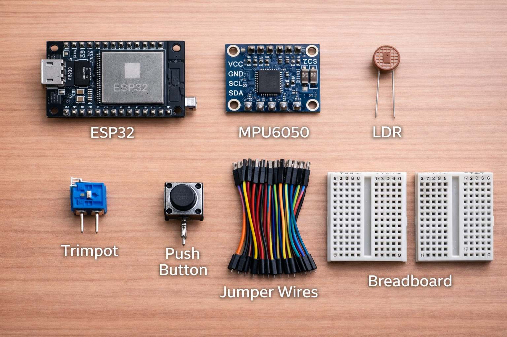

# 🖱️ ESP32 Air Mouse (Gesture-Controlled Bluetooth Mouse)

<p align="center">
  
  
  
</p>

## 🎥 Demo

[Watch Demo Video](https://drive.google.com/file/d/1MSBBIaKNtVudaXrS6Y54ZaqaBt7hvsUB/view?usp=sharing)

## 📌 Project Overview

The **ESP32 Air Mouse** is a wearable, gesture-controlled Bluetooth mouse built using an ESP32 microcontroller, an MPU6050 motion sensor, and an LDR (Light Dependent Resistor) for click detection.

Instead of using a physical surface like a traditional mouse, this device allows users to control cursor movement through **hand tilting (orientation)** and perform clicks using **light gestures**.

This project demonstrates concepts from:

- Embedded Systems
- Sensor Fusion (Kalman Filtering)
- Human-Computer Interaction (HCI)
- Bluetooth Low Energy (BLE HID)

---

## 🎯 Features

- 🎮 Cursor movement using hand tilt (MPU6050)
- 🖱️ Left-click using LDR (light blocking gesture)
- 🔘 Toggle ON/OFF using push button
- 📡 Bluetooth HID (acts as a real mouse)
- ⚖️ Smooth motion using Kalman Filter
- 🧠 Auto-calibration for accurate control

---

> 📸 **Component Overview Image**



## 🧰 Components Required

| Component           | Quantity | Description                |
| ------------------- | -------- | -------------------------- |
| ESP32 (Dev Board)   | 1        | Main microcontroller       |
| MPU6050             | 1        | Accelerometer + Gyroscope  |
| LDR (Photoresistor) | 1        | Detects light for clicking |
| 100kΩ Resistor      | 1        | Voltage divider for LDR    |
| Push Button         | 1        | Toggle power ON/OFF        |
| Jumper Wires        | Several  | Connections                |
| Perfboard           | 1        | Permanent soldering        |
| Battery (Optional)  | 1        | Portable power             |

---

## ⚡ Circuit Connections

### 🔌 MPU6050 (I2C Connection)

| MPU6050 Pin | ESP32 Pin |
| ----------- | --------- |
| VCC         | 3.3V      |
| GND         | GND       |
| SDA         | GPIO 21   |
| SCL         | GPIO 22   |

---

### 💡 LDR (Click Sensor - Voltage Divider)

| Component              | Connection               |
| ---------------------- | ------------------------ |
| One side of LDR        | 3.3V                     |
| Other side of LDR      | GPIO 34 + 100kΩ resistor |
| Other side of resistor | GND                      |

👉 This forms a **voltage divider**:

- Bright light → HIGH value
- Covered (dark) → LOW value → triggers click

---

### 🔘 Toggle Button

| Button Pin | ESP32 Pin |
| ---------- | --------- |
| One side   | GPIO 14   |
| Other side | GND       |

👉 Uses **internal pull-up resistor**

---

## 🧠 System Architecture

```
MPU6050 → Kalman Filter → Angle Calculation → Cursor Movement
LDR → Light Detection → Click Trigger
Button → Toggle System State
ESP32 → BLE HID → Computer
```

---

## 🧮 How It Works

### 1. Motion Tracking (MPU6050)

The MPU6050 provides:

- Accelerometer data (tilt angle)
- Gyroscope data (rotation speed)

These are combined using a **Kalman Filter** to produce smooth and stable angles:

- Roll → X-axis movement
- Pitch → Y-axis movement

---

### 2. Kalman Filtering

The Kalman filter reduces:

- Noise
- Drift
- Sudden spikes

It combines:

- Accelerometer (stable but noisy)
- Gyroscope (smooth but drifts)

Result → **Accurate orientation tracking**

---

### 3. Cursor Movement

After calibration:

```
dx = current_roll - center_roll
dy = current_pitch - center_pitch
```

Then:

- Apply dead zone (ignore small movements)
- Multiply by sensitivity
- Clamp between -127 and 127

---

### 4. Click Detection (LDR)

- Light present → No click
- Hand covers LDR → Click triggered

Logic:

```
if value < threshold:
    trigger click
```

---

### 5. Toggle Button

- Press → Toggle system ON/OFF
- When OFF:
  - No movement
  - No clicks

---

### 6. Bluetooth Communication

ESP32 acts as a:

> **Bluetooth Low Energy HID Device (Mouse)**

It sends:

- Cursor movement (X, Y)
- Button clicks

---

## 🛠️ Installation & Setup

### 1. Flash MicroPython Firmware

Install MicroPython on ESP32 using:

- Thonny IDE or esptool

---

### 2. Upload Required Files

Upload these to ESP32:

- `main.py`
- `MPU6050.py`
- `Kalman.py`
- `hid_services.py`
- `hid_keystores.py`

---

### 3. Power On

- Connect ESP32
- Open serial monitor
- Reset board

---

## 📡 Pairing with Computer

1. Turn on Bluetooth on your PC
2. Search for:

   ```
   ESP32 Air Mouse
   ```

3. Pair device
4. Cursor should start moving after calibration

---

## 🎯 Calibration Process

When the device starts:

1. Keep hand **flat and still**
2. System collects:
   - Gyroscope offsets
   - Center position

Output example:

```
Calibrating...
Gyro Offsets - X: 0.02, Y: -0.01
Calibration Complete. Center: X=1.2, Y=0.5
```

---

## 🧪 Testing the System

### ✅ Test 1: MPU6050

- Move hand
- Cursor should move smoothly

---

### ✅ Test 2: LDR Click

- Cover LDR with finger
- Should trigger click

If not:

- Adjust:

```
CLICK_THRESHOLD = 400
```

---

### ✅ Test 3: Button Toggle

- Press button
- System should:
  - Disable movement
  - Enable again when pressed

---

### ✅ Test 4: Bluetooth

- Ensure device connects
- If not:
  - Restart ESP32
  - Re-pair device

---

## ⚙️ Configuration Options

### Sensitivity

```
SENSITIVITY_X = 1.2
SENSITIVITY_Y = 1.2
```

---

### Dead Zone

```
DEAD_ZONE = 6
```

---

### Click Threshold

```
CLICK_THRESHOLD = 400
```

---

## 🔋 Power Options

- USB (for development)
- LiPo Battery (portable use)

---

## 📦 Wearable Design Tips

- Place MPU6050 under ESP32
- Use compact wiring
- Keep LDR exposed to light
- Use small perfboard layout
- Mount under palm or glove

---

## ⚠️ Troubleshooting

### Cursor is shaky

- Increase dead zone
- Improve calibration

---

### Cursor drifts

- Recalibrate
- Ensure hand is steady during calibration

---

### Click not working

- Adjust threshold
- Check LDR wiring

---

### Bluetooth not connecting

- Restart ESP32
- Remove and re-pair device

---

## 🚀 Future Improvements

- Right-click gesture
- Scroll gesture
- Gesture-based shortcuts
- Rechargeable battery module
- 3D printed casing

---

## 👨‍💻 Author

Developed as an embedded systems and HCI project using ESP32 and MicroPython.

---

## 📜 License

This project is open-source and available under the MIT License.

---

## 🙌 Acknowledgements

- MPU6050 libraries
- Kalman filter implementation
- BLE HID MicroPython library

---

## 🎉 Conclusion

This project demonstrates how embedded systems can replace traditional input devices using **gesture-based interaction**, combining hardware and software into a powerful, wearable interface.

---
