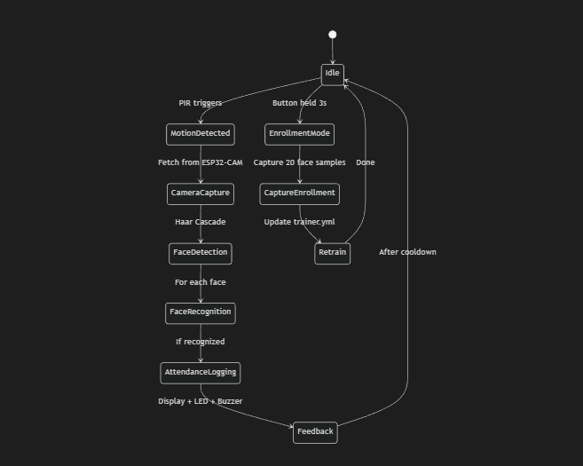
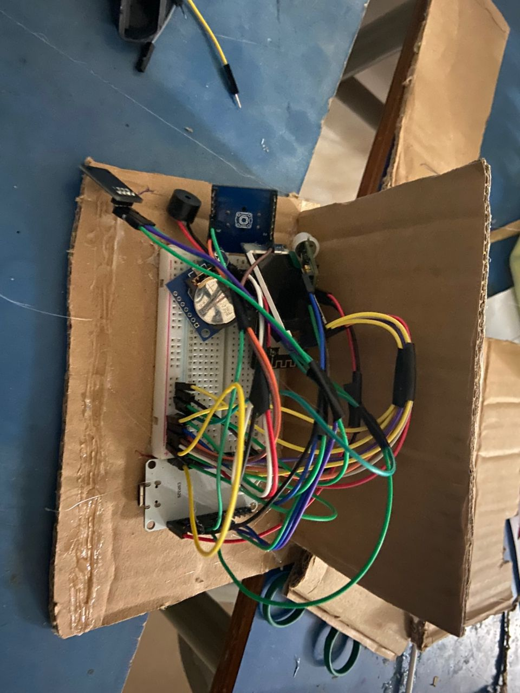
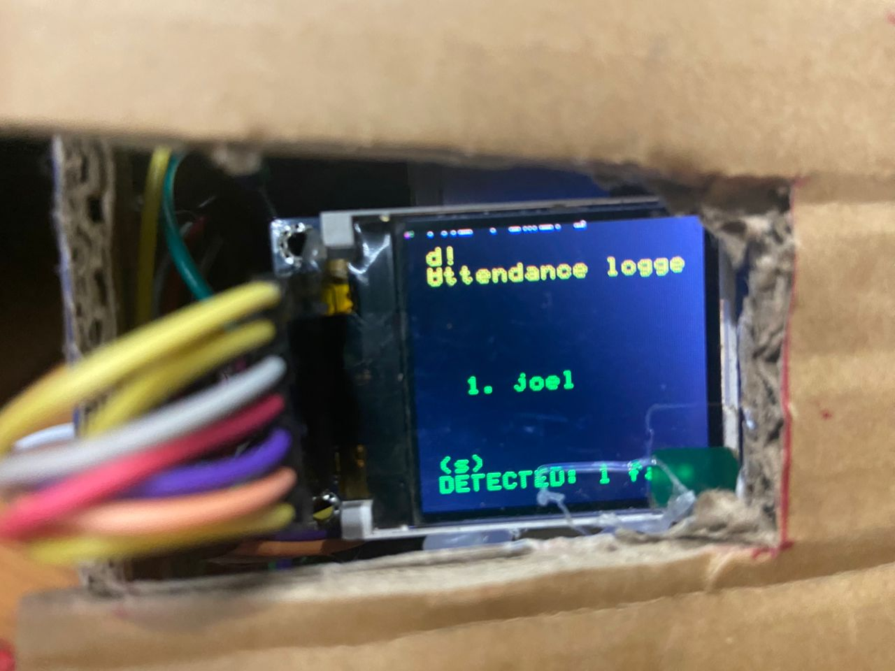
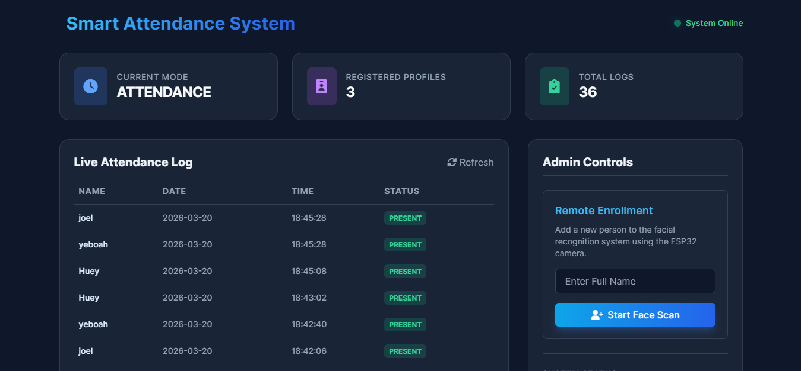

# Smart Multi-Face Recognition Attendance System

## Project Overview
This project is an edge-to-cloud Internet of Things attendance tracking system. Our team(Group 5) developed this solution to automate class or workplace attendance by using facial recognition. Instead of relying on manual roll calls, RFID cards, or individual fingerprint scans, our system passively scans the environment, recognizes multiple people simultaneously, and logs their attendance in real-time. It features a complete hardware ecosystem working in tandem with a Python-based PC server and a live web dashboard.

## Problem Statement / Motivation
Traditional methods of taking attendance are time-consuming and prone to inaccuracies, such as buddy punching. We wanted to build a seamless, secure, and touchless system that could identify individuals simply by them looking at a camera. Our motivation was to integrate edge hardware with heavier computer vision processing, demonstrating how low-cost microcontrollers can facilitate advanced AI tasks.

## System Architecture
Our system operates through a distributed architecture. The physical environment is monitored by a primary ESP32-S3 microcontroller, which handles all sensory input and user feedback. An ESP32-CAM module acts as a dedicated wireless camera, streaming data over Wi-Fi. Finally, a central PC handles the computationally expensive facial recognition processing, manages the data storage, and serves the web dashboard.

## Hardware Design
The hardware components are centered around an ESP32-S3 Main Board. We used interrupts to ensure the microcontroller reacts instantly to hardware events. The setup includes:
- **PIR Motion Sensor (GPIO 13):** Idles the system to save power and trigger a scan only when motion is detected.
- **Push Button (GPIO 27):** Allows manual triggering of scans or, when held down, switches the system into enrollment mode.
- **ST7735 TFT Display (SPI):** Provides visual feedback to the user, displaying scan status, mode, and recognized names.
- **RTC Module (I2C):** A DS3231/DS1307 Real-Time Clock (SDA=21, SCL=22) maintains accurate local time, displaying timestamps on the TFT and ensuring reliable motion logging.
- **RGB LED and Buzzer:** Deliver immediate visual and audio success or failure indicators.
- **ESP32-CAM Module:** Streams VGA (640x480) JPEG frames to the PC server via a local 2.4 GHz Wi-Fi hotspot.

## Software Architecture
The software is divided between microcontrollers and a central server:
- **MicroPython (ESP32-S3):** The main board runs an event-driven MicroPython script that monitors interrupts, controls external hardware, and communicates with the PC via Serial USB.
- **OpenCV & Flask (PC Server):** The PC runs the main server application. It pulls image frames from the ESP32-CAM over HTTP and processes them using Haar Cascades for face detection and Local Binary Patterns Histograms (LBPH) for face recognition. It also runs a local Flask server to provide a web interface.
- **Data Persistence:** Recognition models are trained dynamically and stored as a YAML file, while identities are mapped using a JSON file. Attendance records are automatically persisted to both CSV and Excel formats.

## Repository Structure
The repository contains the following major files and components:

- **pc_server.py**
  Purpose of the file: The core application that runs on the computer.
  Key responsibilities: It integrates the camera feeds, processes facial recognition using the OpenCV model, handles communications with the ESP32 via Serial, and hosts the Flask web dashboard.
  How it interacts with other modules: Pulls image feeds from the ESP32-CAM server over HTTP and sends/receives hardware triggers to the main board over USB Serial.

- **esp32_main_board.py**
  Purpose of the file: The firmware uploaded to the primary ESP32-S3.
  Key responsibilities: It manages PIR sensor interrupts, button presses, and TFT display rendering.
  How it interacts with other modules: Communicates state changes or triggers to the PC Server via serial commands.

- **esp32_cam_server.py**
  Purpose of the file: The firmware uploaded to the ESP32-CAM.
  Key responsibilities: Acts as a lightweight HTTP server.
  How it interacts with other modules: Provides endpoints for the PC Server to capture singular JPEG frames or continuous streams.

- **train_faces.py**
  Purpose of the file: A model training script.
  Key responsibilities: Reads the dataset folder, extracts facial regions, assigns IDs, and trains the facial recognition model.
  How it interacts with other modules: Generates the trainer.yml LBPH model and labels.json identity map used by the PC server.

- **pc_attendance_with_pir.py**
  Purpose of the file: A legacy or standalone version of the attendance tracker.
  Key responsibilities: Focuses purely on PIR-triggered scanning.
  How it interacts with other modules: Provides core facial recognition behavior without the overhead of the Flask dashboard.

- **scan.py**
  Purpose of the file: A minimal testing script.
  Key responsibilities: Validates the recognition model using a local PC webcam.
  How it interacts with other modules: Reads the trained model and labels for quick offline testing.

- **enroll_face.py**
  Purpose of the file: A standalone utility script.
  Key responsibilities: Used to capture new face samples and append them to the dataset manually if needed.
  How it interacts with other modules: Feeds data into the directory that train_faces.py processes.

## System Workflow
1. The ESP32-S3 main board initializes and calibrates the PIR sensor.
2. When a person steps in front of the device, the PIR sensor detects motion.
3. The ESP32-S3 sends a trigger signal to the PC via USB Serial.
4. The PC server requests a continuous stream of images from the ESP32-CAM for a set duration (typically 4 seconds).
5. The PC processes these frames, identifies all valid consecutive faces, and logs them into the attendance files.
6. The PC replies to the ESP32-S3 with the recognized identities.
7. The ESP32-S3 displays the names on the TFT screen, flashes the green LED, and plays a success sound from the buzzer.

## Setup Instructions
Due to the extensive hardware footprint (involving precision wiring to the ESP32-S3 alongside MicroPython firmwares) all installation procedures are deeply outlined in a separated setup guide.

Please thoroughly read the **[Comprehensive Setup Guide (SETUP_INSTRUCTIONS.md)](./SETUP_INSTRUCTIONS.md)**. 

The guide details:
- Complete PC dependencies and software installation.
- Exact GPIO pin mapping for the TFT Display, RTC, PIR Sensor, Buzzer, LED, and Push Button.
- The step-by-step firmware flashing process using Thonny IDE.
- Pre-configured mobile hotspot deployments (`Project_Testing`).

## Running the System
Once the setup is complete, you can begin using the system:
1. Power up the ESP32-S3 main board and wait 30 seconds for the PIR sensor to calibrate.
2. Power up the ESP32-CAM and confirm it connects to your Wi-Fi network.
3. Run the main server on your PC via the command line.
4. Open a web browser and navigate to the localhost port 5000 to view the live dashboard.
5. Wave at the PIR sensor or press the physical button on the ESP32-S3 to trigger an attendance scan.

## Face Enrollment
The system cannot recognize someone until they are enrolled. This can be done remotely via the Web Dashboard or physically on the device. By holding the physical push button for 3 seconds, the ESP32-S3 shifts into Enrollment Mode. The PC will prompt for a name, and the ESP32-CAM will capture numerous face samples from various angles. Alternatively, entering a name on the dashboard will queue the request remotely. The PC saves these images, retrains the recognition model on the fly, and systematically returns to Attendance Mode.

## Attendance Logging
Our system supports multiple face detection. During a scan, OpenCV Haar Cascades simultaneously draw bounding boxes around any detected faces in the frame. Each face is cropped and passed individually to the LBPH recognizer. If a recognized face maintains a high confidence score across multiple consecutive frames, their presence is confirmed.

Confirmed identities are actively logged to local CSV and Excel records alongside a date and timestamp. To prevent duplicate log entries during a single scanning session, the platform enforces a 30-second logic cooldown per person before they can be officially logged again.

## Demonstration
Below is a video demonstrating our system capturing faces and logging attendance in real-time.

<video src="./assets/videos/sample-video-demo.mp4" controls></video>

## Challenges Faced
One of the major challenges our team faced was the low image quality and general instability of the ESP32-CAM module. Because facial recognition requires clear, high-contrast imagery, the camera's budget sensor often struggled under varying lighting conditions, making reliable detection difficult. Furthermore, ensuring the ESP32-CAM reliably transmitted frames over Wi-Fi without dropping out or crashing demanded that we permanently lower the frame resolution to standard VGA and implement retry logic within our HTTP requests.

Beyond the camera, syncing the asynchronous inputs from the PIR sensor with the synchronous frame fetching of the PC server required us to implement strict serial state checks. Finally, handling multi-face detection efficiently using pure CPU processing on the PC server proved demanding, forcing us to heavily optimize our OpenCV bounding box parameters.

## Future Improvements
To address our current hardware bottlenecks, particularly with camera stability and image quality, future iterations should upgrade from the budget ESP32-CAM (OV2640 sensor) to a more robust module like the ESP32-S3-EYE featuring an OV5640 5MP sensor. Adding a dedicated LED ring light would also solve low-light contrast issues that currently cause false negatives. Furthermore, migrating our video transmission from HTTP streaming to WebSockets or raw UDP would significantly reduce frame latency and Wi-Fi dropouts.

Computationally, we aim to move the facial recognition load entirely to the edge by utilizing dedicated Coral machine learning accelerators instead of a PC. We also want to implement a cloud-based SQL database rather than local CSV files to make attendance tracking universally accessible. Lastly, integrating anti-spoofing measures such as depth mapping or blink detection would ensure the system cannot be tricked by holding up a static photograph.

## Group Members (Group 5)
- **Sussana Teye** (Index: PS/CSC/23/0054) - [GitHub](https://github.com/Sussana7)
- **Joel Anarba Amuni** (Index: PS/CSC/23/0043) - [GitHub](https://github.com/joelanarba)
